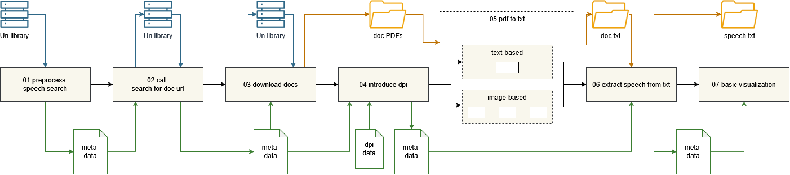

# Project in Data Science - United Nations Secretary-General text corpus
Students: Jakob Schmidt, Huan Li \
Supervisor: Magnus Lundgren \
Examiner: Di Yuan

Scope: building a text corpus of the speeches of the Secretary-Generals of the United Nations

### Abbrevations
|        |                                        |
|:-------|:--------------------------------------:|
| PDS    | Project in Data Science |
| UN     | United Nations |
| SG     | Secretary-General |
| UNSG   | United Nations Secretary-General |
| SR   | Summary Records (type of UN document) |

### Code ownership 
The code ownership is marked at the beginning of each ipynb

## Envisioned workflow of this repo

We split each step into a single notebook and saved the progress and the current metadata in independent files and folders, so our code is hopefully easier to understand and quickly adaptable to changes.

### Final version of the project
We managed to build and run the pipeline as a complete project from notebook 01 to 04. And for the text-based pdfs we were able to run the whole pipeline through and get good looking results. For the image-based pdf files we we encountered from 05 onwards extensive challenges (which we will be further specified in the report) and therefore a final pipeline for these documents could not be build. \
Given that 748 speeches are text-based and only ~250 are image-based, we were still able to cover most of the corpus.

The final extracted speeches are available in the folder data/speeches/extracted

### 01 preprocess speech search
In this notebook we start with a general search for the different speeches of all SGs on the webiste of the UN library https://digitallibrary.un.org/search. We load that data from the MarcXML format and extract all fields that are valuable for us (speaker, record_id, date, speech_code, etc.). We split and create new fields as needed (splitting the speech code, creating file names), so we have it later easier to track our documents through the whole pipeline and see where they are saved. \
Further inital clean up is done, e.g. some documents have to renamed so we can find them in the next step and the data needs to be unicode normalized because of the names of some SGs.\
Lastly the firstly created metadata is saved. At the end of this step with have a dataframe with all names of the pdf documents which should contain a SG speech.

### 02 call search for doc url
In this notebook we iterate through the names of the pdf documents and search them again on the UN library website to obtain the download link for the english pdf version.
We first match exact on the search, then only for the same beginning and what is still unmatched we controlled and updated manually.

### 03 download docs
In this notebook we iterate the download links and save the all the pdf files into one director, giving them the names we earlier specified in our metadata. At the end of this step we finally have all the data we need locally available and can work independent of the UN library website.

### 04 introduce dpi
Document processing info (dpi), is a csv file created manually by us to help us put the pdf documents already in certain categories (e.g. text or image based, two or one column layout), and make the text extraction more robust that way. In this notebook we use the dpi to label each single pdf with these given categories and save that metadata step again.

Further we filter out the SR, because they don't contain the actual wording of the speech but just a summary of the content and therefore could influence the metrics researches could gain from this corpus. We still keep the pdfs downloaded to add them back later if requirements change. 

### 05 pdf to txt
In this step we split up our pipeline to work synchronus. On part of the pipeline is build around extrating text from the pdf that are text based, while the other part is build to extract the text from the older image based pdf documents.

### &emsp; 05 pdf to txt (text-based)
In this notebook all speech related text is extracted from the text-based pdf. Therefore the previously introduced dpi data is used and further header and footers are recognized and cropped out. All complete txt files get saved again in a folder.

### &emsp; 05 pdf to txt (image-based) - convert to single column
in this notebook all image based pdf that are currenlty in a two column layout should be transformed into a one column layout, to make the later analysis more streamline.
### &emsp; 05 pdf to txt (image-based) - extraction
In this notebook all text should be extracted from the image based pdfs. (to be uploaded)
### &emsp; 05 pdf to txt (image-based) - cleanned sg speeches
In this notebook all speeches that were extracted from the image based pdfs are checked for layout quirks that only exist in old documents (e.g. numbering each paragraph), further all tokens are checked against an english corpus to minize faulty extraction from the pdfs.

### 06 extract speech from txt
In this notebook we create a regex to filter out all SG speeches from the complete txt files. A txt file can also contain multiple speeches, then each speech is saved individually. Further we count tokens, types and sentences for each speech and save that with other usefull informations about the speech in the final version of the metadata. At the end of this step we have the metadata for all speeches and the corresponding storage location of the speech.

### 07 basic visualization
In this notebook we build some basic graphs about our speeches and SGs.